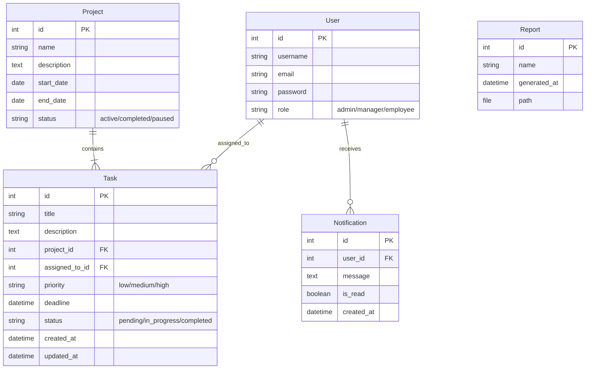

# Employee Management Platform - ER Diagram

```mermaid
erDiagram
    User ||--o{ Task : "assigned_to"
    User ||--o{ Notification : "receives"
    Project ||--|{ Task : "contains"
    
    User {
        int id PK
        string username
        string email
        string password
        string role "admin/manager/employee"
    }

    Project {
        int id PK
        string name
        text description
        date start_date
        date end_date
        string status "active/completed/paused"
    }

    Task {
        int id PK
        string title
        text description
        int project_id FK
        int assigned_to_id FK
        string priority "low/medium/high"
        datetime deadline
        string status "pending/in_progress/completed"
        datetime created_at
        datetime updated_at
    }

    Notification {
        int id PK
        int user_id FK
        text message
        boolean is_read
        datetime created_at
    }

    Report {
        int id PK
        string name
        datetime generated_at
        file path
    }
```
